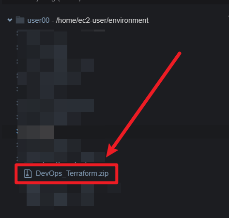

# Terraform on AWS


기존 Cloud9 에서 진행합니다.



1. 아래 명령으로 Terraform 설치

```
sudo yum install -y yum-utils shadow-utils
sudo yum-config-manager --add-repo https://rpm.releases.hashicorp.com/AmazonLinux/hashicorp.repo
sudo yum install terraform
```


유사시 한줄 한줄 진행합니다.



2. terraform 설치 확인

```
terraform
```


3. 제공받은 zip 파일을 Cloud9 에 업로드합니다.

<figure><figcaption></figcaption></figure>


4. 압축을 해제합니다.

```
unzip DevOps_Terraform.zip
```

<figure><figcaption></figcaption></figure>


5. 프로바이더 캐시공유 설정

```
mkdir -p ~/.terraform.d/plugin-cache
cat > ~/.terraformrc <<'EOF'
plugin_cache_dir = "$HOME/.terraform.d/plugin-cache"
EOF
```


6. 권한설정

```
chmod -R u+rwX ~/environment
```


7. 각 디렉토리 안에 README 파일을 보며 실습을 진행합니다.
